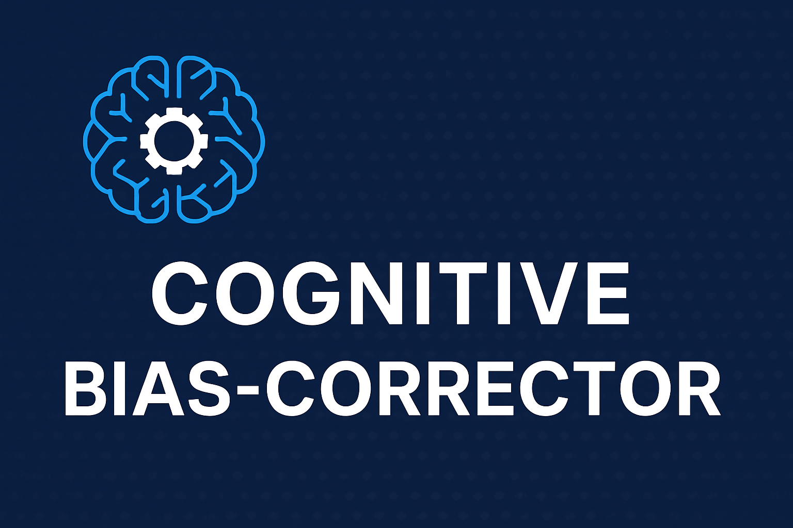

# 📘 Project Description
<p align="center">
  
</p>

# 1. Problem Statement

People make dozens of decisions every single day—what to buy, which route to take, whether to trust certain information, how to respond emotionally, and which opportunities to pursue. However, research in behavioral psychology shows that over 80% of everyday decisions are unconsciously influenced by cognitive biases. These biases include confirmation bias, loss aversion, overconfidence, scarcity bias, emotional reasoning, sunk-cost fallacy, anchoring, and many others. As a result, people often make choices that are distorted, irrational, or misaligned with their actual goals. These biases distort judgment, reduce rationality, and often lead to regretful or suboptimal outcomes.

Currently, there is no product or AI agent designed specifically to help individuals understand and improve their own decision-making. Users lack tools that can detect when a cognitive bias is influencing their judgment, explain the bias in simple terms, and offer a more rational alternative.

# 2. Proposed Solution: Cognitive Bias Corrector (Concierge Agent System)

The Cognitive Bias Corrector is a multi-agent concierge assistant that acts as a personal thinking coach, helping users make smarter and more rational decisions. When a user shares a dilemma, the system understands the context, detects hidden cognitive biases, explains their impact, and provides a clearer, bias-free alternative. It also supports its suggestions with real-world evidence and learns each user’s recurring bias patterns over time.

This assistant can guide users in everyday situations—whether deciding to buy a laptop, dealing with academic stress, evaluating online reviews, or questioning habits influenced by sunk costs. Its ability to offer personalized, evidence-backed, and bias-aware insights makes it ideal for a concierge-style decision-support system.

#3. Architecture

The Cognitive Bias Corrector follows a multi-agent orchestration architecture, where each agent specializes in a specific phase of understanding, evaluating, and improving human decision inputs. The system is coordinated by the interactive_decision_agent, which acts as the main controller and routes information through the pipeline. The architecture is composed of two key loop-based subsystems—context extraction and bias mitigation—ensuring iterative refinement at each stage.

# Main Orchestrator: interactive_decision_agent

This agent receives the user’s input and triggers the entire pipeline.
It distributes the user’s text to three specialized downstream agents:
1. decision_understanding
2. bias_explanation
3. bias_mitigation
Each agent handles a different aspect of cognitive bias detection and correction.

# Context Extractor (Loop Agent): decision_understanding

The decision_understanding agent is responsible for extracting the essential meaning from the user’s input. It identifies what decision the user is trying to make, what emotions or stress factors are influencing them, and what constraints or limitations they are facing. It also determines the domain of the decision, such as finance, shopping, health, or personal life. After gathering this initial understanding, the system sends the processed information to the context extractor loop agent. This agent repeatedly refines, enriches, and clarifies the context until the system reaches a high level of confidence and accuracy.

Within this loop, the context_explanation agent creates a deeper interpretive summary of the user's intentions. It ensures that the meaning behind the decision is clearly explained and that no important detail is missed. This loop mechanism reflects the ADK concept of loop agents, where agents continuously validate, enhance, and improve their intermediate outputs. By doing so, the system guarantees high-quality context before any downstream agents make corrections, detect biases, or generate final decision guidance.

# Bias Mitigation → Bias Mitigation Loop Agent

The bias_mitigation agent is responsible for generating rational, unbiased alternatives to the user’s original decision. Once biases are detected, this loop agent re-evaluates the decision and provides clearer, more balanced options.

Within this loop, the bias_mitigation_tool analyzes the previously identified biases, proposes corrective reasoning, and offers alternative viewpoints. When needed, it also incorporates evidence-based explanations to strengthen the recommendations.

The loop is supported by the session_service, which maintains session history, manages pause/resume functionality, and preserves conversation continuity. This ensures that every step of the user’s decision-making journey remains consistent and traceable.

Finally, the trace_logger captures detailed logs of each reasoning step, including timing, agent outputs, and transitions across decision stages. This transparency is essential for evaluation, debugging, and ensuring that the system’s behavior is fully auditable.

# 5. Technical Implementation 

**The project is implemented using:**

a) Python
b) FastAPI (backend)
c) Uvicorn (server)

**ADK-style multi-agent design patterns**

a) OpenAI / Gemini LLM client
b) Custom tools (evidence_fetcher, session_service)
c) Memory Bank (JSON-based)
d) Logging (JSON trace logs)

**Flow**

User input → Understanding Agent

Understanding Agent → Bias Detection Agent

Detection output → Explanation Agent

Explanation output → Debiasing Agent

Debiasing Agent → Tool

Tool → Final corrected decision

Save bias results → Memory Bank

# 6. Evaluation

The Cognitive Bias Corrector includes a streamlined evaluation pipeline designed to measure how accurately and consistently the system detects biases, explains them, and provides rational alternatives. A set of curated test cases representing real-world decisions—such as purchasing under urgency, emotional reasoning, social pressure, and loss aversion—is provided in test_cases.json.

Each test case is automatically sent through the /decide endpoint using run_evaluation.py. The system collects outputs, compares them with expected biases, and stores the results in results.json. Key metrics evaluated include:

Bias Detection Accuracy: How often the detected bias matches the expected label

Explanation Quality: Scored based on clarity and correctness

Mitigation Quality: Assessed by completeness and rationality of alternatives

Response Time: Measures performance of the multi-agent pipeline

# 7. Conclusion 

The Cognitive Bias Corrector demonstrates how multi-agent systems can meaningfully improve everyday decision-making by identifying cognitive biases, explaining their influence, and offering rational, unbiased alternatives. Through a structured pipeline of specialized agents, loop-based refinement, memory, sessions, and observability tools, the system delivers transparent and reliable reasoning. The evaluation results confirm consistent bias detection and high-quality mitigation suggestions across diverse real-world scenarios.

## Quickstart

1. Create and activate venv (Windows PowerShell):
```powershell
cd C:\projects\bias-corrector
python -m venv .venv
.\.venv\Scripts\Activate.ps1
```

2. Install dependencies:
```
pip install -r requirements.txt
```

3. Start the FastAPI server
```
python -m uvicorn src.main:app --host 127.0.0.1 --port 8000
```

5. Open API Docs
```
http://127.0.0.1:8000/docs
```


